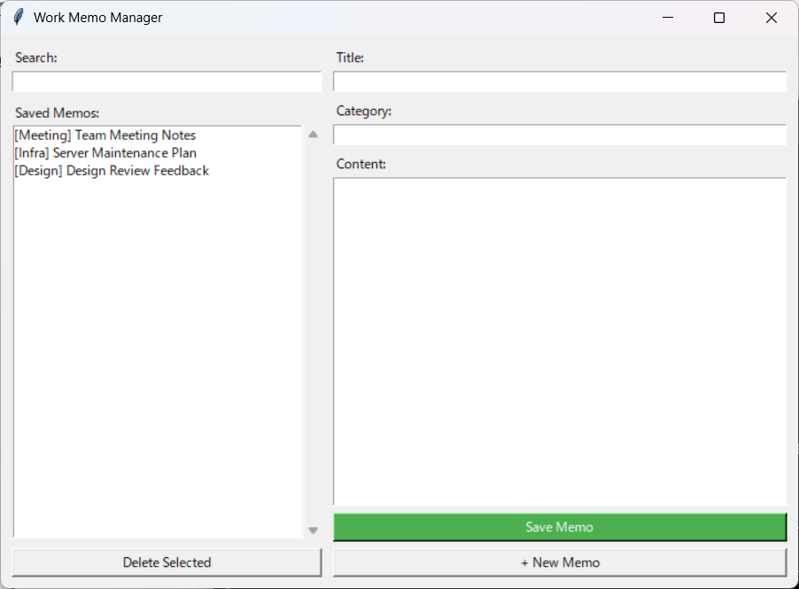

# Work Memo Manager

A simple desktop memo app built with Python tkinter. Write, search, and organize work memos — all saved locally as a JSON file.

> **Vibecoding Practice Project** — this app was built entirely by an AI assistant ([Claude Code](https://claude.ai/code)). No human wrote a single line of code.



## Features

- Write memos with a **title**, **category**, and **content**
- All memos saved locally in `memos.json`
- **Search** memos by title or content in real time
- Click a memo to view its details
- **Delete** memos with a confirmation prompt
- **+ New Memo** button to clear the form and start fresh

## How to Run

### Option 1: Run the .exe (no Python needed)

Download `MemoManager.exe` from the [Releases](https://github.com) page and double-click it.

### Option 2: Run with Python

```bash
python memo_manager.py
```

No external packages required — only Python's built-in `tkinter` and `json`.

## How Data Is Saved

All memos are stored in `memos.json` in the same folder as the app. Each memo looks like:

```json
{
  "id": 1,
  "title": "Team Meeting Notes",
  "category": "Meeting",
  "content": "Discussed Q3 roadmap..."
}
```

The file is plain JSON — you can back it up, edit it by hand, or sync it with any cloud drive.

## Project Structure

```
├── memo_manager.py    # Main application (single file, ~230 lines)
├── memos.json         # Your memo data (auto-created on first save)
├── screenshots/       # App screenshots
│   └── memo-manager.png
└── README.md
```
